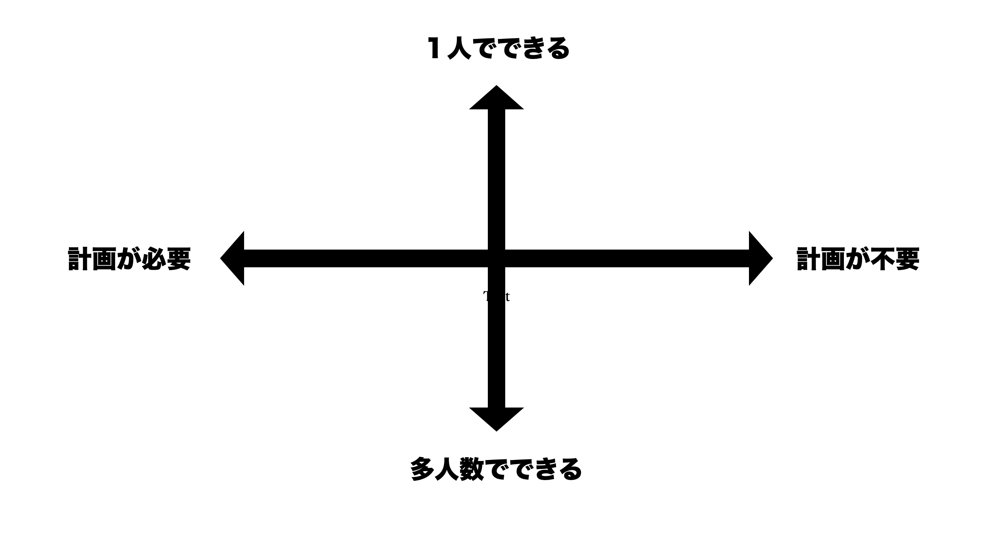

とある若者は、いった。

「休日にできる、趣味がほしい」

その時、ふと僕は趣味とはなんなのだろうかと思ってしまった。

趣味がほしいと思っている人はもしかしたらけっこう多いのかもしれない。

**趣味とは何か？**

という切り口にたったときに、僕の中では今の生活に対する満足度をよりよくしてくれるものだと思う。

そのため、この前提からすると、この趣味がほしいと言っている若者は、今の自分に満足していないということだ。

たしかに今の自分に満足していないのであれば、より良くしたいと考えるのが人間だと思う。

じゃあ、何を趣味にもつ、何をすれば人は満足感を得ることができるかということを僕は考え始めた。

---

# 充実感を得るには？

人に趣味を趣味をきくと様々なものがあるが僕は以下2軸で趣味を考えてみようと思う。

- 1人でできるか？多人数でやるか？
- 計画が必要か？否か。？

計画をしたものは楽しいし、充実感をすごく得られるが、その分準備のコストが高い。  
一人でできて計画が少ないものほど、実行までに書ける時間、コミュニケーションコストも収まる分、充実感のようなものは少ない。

僕の仮説としては、このようにマッピングしたときに、趣味はこの4象限に対して、最低一つづつでも持っていると、自分の人生に対して満足度をが上がるのではないか？ということである。

また、趣味という枠組みにとらわれず、自分の1日24時間、1週間、1年の時間の使い方が4象限に均等にマッピングをンできれば、人生の満足度というものは上がるではないかと思った。

典型的な例でいうと、社会人は仕事である。仕事は計画が必要で、多人数でやるに分類される。
もし仮に今やっている仕事に対して、自分のなかで長期的な計画がない、人と関わり何かを達成しようとしている感じを得られない。となると、この象限に位置するものが欠落し、自分の未来について充実感を持ちにくいものとなると思う。

また、逆に学生時代をふりかえると、計画が必要なものをやる機会は学生時代は強制はされていなかったと思う。そのため、何かを達成するために時間をかけて熱中できるものがないという悩みが多かった気がする。学生時代は計画が不要なものは多くできた一方、計画が必要なことを時間をかけてやるという機会を得ること、作ることはの難しかったと思う。

この4象限をもとに具体的な人物像を言葉にして描いてみる。

今を充実させつつ、未来にも布石を打ていて、色々な人に愛され、また自分の時間も大切にできる。

言葉にしてみると、とても充実してそうな人物像ができあがった。
この仮説はあってそうな予感がする。

もし、今の人生にたいして、充実感がたりていないようであれば自分時間をマッピングしてみて、何がたりないのか考える材料にしてみて貰えればと思う。

---

# 満足の礎

最後に、ある時僕の先輩がいっていた。

「若い時は生きるのに精一杯でそんなことを考えることもなかった。」

また、別の先輩が言っていたことをもう一つ紹介する。

「今の若い子は大変。自分のときのように甘くない。」

趣味がほしいと考えられることは、生活に余裕があると思えていることであり、それはとても幸運なことか、もしくはそもそも気づいていないのかもしれない。

この、充実とは何かについて考えるのは、余裕がある人、比較しなくていい人生の特権でもある。
今の余裕がある、比較する必要がないうちに自分が満足する礎を築いておくとよいのだろう。
